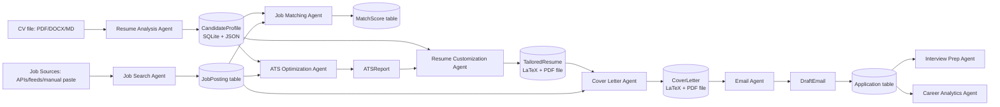
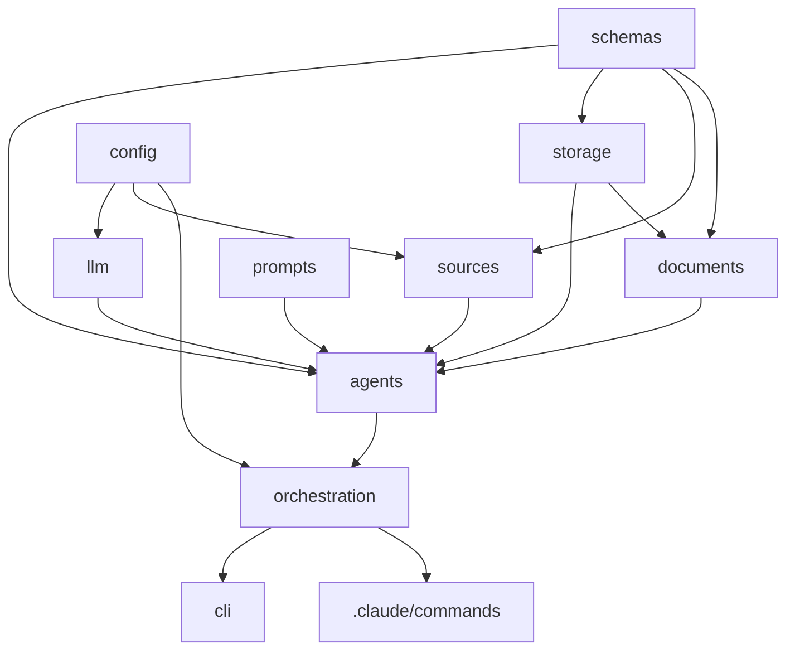

# System Architecture — JOB_HUNT

Status: Draft v1.0 · Last updated: 2026-08-02

Related: [`PRD.md`](PRD.md) (why) · [`design.md`](design.md) (how, in
detail) · [`decisions.md`](decisions.md) (why *this* shape and not
another) · [`agents.md`](agents.md) (per-agent specs) ·
[`folder_structure.md`](folder_structure.md) (full tree)

## 1. Architectural Overview

JOB_HUNT is a **local-first, layered, plugin-based multi-agent system**.
It has three cooperating layers:

```
┌──────────────────────────────────────────────────────────────────┐
│ Layer 3 — Interaction Surface                                     │
│  .claude/commands/*.md   .claude/skills/*/SKILL.md   CLI (jobhunt)│
│  (Claude Code slash commands are the primary UX; the CLI is a     │
│   thin, scriptable/CI-testable entry point into the same core)    │
├──────────────────────────────────────────────────────────────────┤
│ Layer 2 — Orchestration                                           │
│  Pipeline Orchestrator · Agent Registry · Context/State Manager   │
├──────────────────────────────────────────────────────────────────┤
│ Layer 1 — Core Library (jobhunt_core, pure Python, no Claude Code │
│  dependency — independently pip-installable and unit-testable)    │
│  Agents · LLM Provider Layer · Storage Layer · Document Rendering │
│  · Job Source Connectors · Prompt Library · Config · Logging      │
└──────────────────────────────────────────────────────────────────┘
```

This split exists so the **core logic is never coupled to Claude Code**
(`decisions.md` ADR-0004): every agent is a plain Python class that can
be imported, unit-tested, and invoked from a script — Claude Code
commands are a UX layer on top, not the only way in. This is what makes
`testing.md`'s "no live LLM calls in unit tests" requirement possible
and what keeps the project usable by contributors who don't use Claude
Code.

## 2. Module Relationships

```
jobhunt_core/
├── agents/          → depends on: llm/, prompts/, storage/, schemas/
├── llm/             → depends on: config/  (no dependency on agents/)
├── storage/         → depends on: schemas/ (no dependency on agents/ or llm/)
├── documents/       → depends on: schemas/, storage/ (LaTeX/Markdown rendering)
├── sources/         → depends on: schemas/, config/ (job board connectors)
├── prompts/         → depends on: nothing (pure templates + loader)
├── schemas/         → depends on: nothing (Pydantic models — the shared vocabulary)
├── orchestration/   → depends on: agents/, schemas/, storage/
└── config/          → depends on: nothing
```

Rule of thumb enforced by `rules.md`: **dependencies point inward toward
`schemas/` and `config/`; nothing outside `agents/` imports from
`agents/`.** This keeps the dependency graph acyclic and each layer
independently testable — see the full graph in §7.

`schemas/` is the deliberate center of gravity: every agent's input and
output is a Pydantic model defined once in `schemas/`, so two agents
never need to agree informally on a dict shape (see `api.md` for the
concrete contracts).

## 3. Agent Architecture

Every agent implements one common interface (`api.md` §Agent API):

```python
class Agent(Protocol):
    name: str
    input_schema: type[BaseModel]
    output_schema: type[BaseModel]

    def run(self, input: BaseModel, ctx: RunContext) -> AgentResult: ...
```

`RunContext` carries the candidate profile, config, LLM provider handle,
and a `run_id` for logging/tracing — agents never reach into global
state directly (`rules.md`). `AgentResult` wraps the typed output plus
metadata: prompt version, model used, token counts, cost, latency, and
any warnings (e.g., "3 requirements from the posting had no matching
CV evidence").

Agents are registered in an `AgentRegistry` (`orchestration/registry.py`)
keyed by name, discovered at startup from `agents/` via a decorator
(`@register_agent("resume_analysis")`). The registry is what makes the
system extensible: **adding an agent never means editing the
orchestrator** — see §6 Plugin Architecture.

### 3.1 The core pipeline (v1 agents, in fixed sequence per the product spec)

```
                 ┌────────────────────┐
User CV ────────▶│ Resume Analysis    │──▶ CandidateProfile
                 └────────────────────┘
                          │
                          ▼
                 ┌────────────────────┐
Target roles ───▶│ Skill Gap Agent    │──▶ SkillGapReport
                 └────────────────────┘
                          │
                          ▼
                 ┌────────────────────┐
Search config ──▶│ Job Search Agent   │──▶ list[JobPosting]
                 └────────────────────┘
                          │
                          ▼
                 ┌────────────────────┐
CandidateProfile▶│ Job Matching Agent │──▶ list[MatchScore]
                 └────────────────────┘
                          │
                          ▼
                 ┌────────────────────┐
                 │ ATS Optimization   │──▶ ATSReport (keyword gaps)
                 │ Agent              │
                 └────────────────────┘
                          │
                          ▼
                 ┌────────────────────┐
                 │ Resume Customization│─▶ TailoredResume (LaTeX + PDF)
                 │ Agent              │
                 └────────────────────┘
                          │
                          ▼
                 ┌────────────────────┐
                 │ Cover Letter Agent │──▶ CoverLetter (LaTeX + PDF)
                 └────────────────────┘
                          │
                          ▼
                 ┌────────────────────┐
                 │ Email Generation   │──▶ DraftEmail
                 │ Agent              │
                 └────────────────────┘
                          │
                          ▼  (human review + submit gate)
                 ┌────────────────────┐
                 │ Application        │──▶ Application record (tracked)
                 │ Tracking Agent     │
                 └────────────────────┘
                          │
                          ▼ (on status = interview_scheduled)
                 ┌────────────────────┐
                 │ Interview Prep     │──▶ InterviewPrepPack
                 │ Agent              │
                 └────────────────────┘
                          │
                          ▼ (continuous, cross-application)
                 ┌────────────────────┐
                 │ Career Analytics   │──▶ AnalyticsReport
                 │ Agent              │
                 └────────────────────┘
```

This is a **staged pipeline, not a rigid monolith**: each stage's output
is persisted (`storage/`) and each stage can be invoked independently
(e.g., re-run just Cover Letter Agent after a manual CV edit) — the
orchestrator does not force a full re-run of upstream stages. See
`decisions.md` ADR-0005 (pipeline vs. graph orchestration).

## 4. Workflow Diagram — End-to-End "Apply to One Posting"

```mermaid
sequenceDiagram
    participant U as User (Claude Code)
    participant O as Orchestrator
    participant M as Job Matching Agent
    participant ATS as ATS Optimization Agent
    participant R as Resume Customization Agent
    participant C as Cover Letter Agent
    participant E as Email Agent
    participant T as Application Tracker
    participant S as Storage (SQLite + files)

    U->>O: /apply <job_url>
    O->>S: fetch CandidateProfile, JobPosting
    O->>M: score(profile, posting)
    M-->>O: MatchScore + rationale
    O->>U: show score; confirm proceed?
    U-->>O: yes
    O->>ATS: analyze(profile, posting)
    ATS-->>O: ATSReport (keyword gaps)
    O->>R: customize(profile, posting, ATSReport)
    R-->>O: TailoredResume (LaTeX)
    R->>R: compile to PDF, extract text, verify ATS-readability
    O->>C: draft(profile, posting, TailoredResume)
    C-->>O: CoverLetter (LaTeX → PDF)
    O->>E: draft_email(posting, CoverLetter)
    E-->>O: DraftEmail
    O->>U: present full package for review
    U-->>O: approve / edit
    O->>T: record_application(package, status=drafted)
    T->>S: persist Application row + document versions
```

## 5. Data Flow



All persistent state lives in two places (`database.md`, `design.md`
§Database Design):
- **Structured data** → SQLite via SQLAlchemy (`storage/db.py`).
- **Rendered artifacts** (PDFs, LaTeX sources, raw scraped HTML/JSON) →
  filesystem under `data/documents/` and `data/raw/`, referenced by path
  from the DB rows — never stored as DB blobs (`decisions.md` ADR-0006).

## 6. Communication Flow & Plugin Architecture

Agents **never call each other directly**. All inter-agent handoff goes
through the Orchestrator, which resolves an agent's declared
`input_schema` from either (a) direct user input, or (b) a prior stage's
persisted output looked up via `storage/`. This indirection is what lets
any agent be re-run, skipped, or replaced independently.

### Plugin architecture — adding a new agent (e.g., "LinkedIn Agent")

1. Add `agents/linkedin_agent.py` implementing the `Agent` protocol,
   decorated `@register_agent("linkedin")`.
2. Define its input/output Pydantic models in `schemas/linkedin.py`.
3. Add its prompt template(s) to `prompts/library/linkedin/*.md`
   (`prompts.md`).
4. (Optional) Add a Claude Code command `.claude/commands/linkedin.md`
   and/or a CLI subcommand.
5. Register it in `config/agents.yaml` (enable/disable, model tier,
   rate limit — `config.md`).

No existing file is modified. This is validated by `testing.md`'s
requirement that a "new agent smoke test" adds only new files. The same
mechanism covers future Job Source connectors (`sources/`) and CV/cover
letter templates (`documents/templates/`) — see `decisions.md` ADR-0008.

### Plugin points summary

| Extension point | Directory | Registered via |
|---|---|---|
| New agent | `agents/` | `@register_agent` decorator + `config/agents.yaml` |
| New job source | `sources/` | `@register_source` decorator + `config/sources.yaml` |
| New document template | `documents/templates/` | template registry file (`templates/registry.yaml`) |
| New LLM provider | `llm/providers/` | `@register_provider` decorator + `config/llm.yaml` |
| New Claude Code command | `.claude/commands/` | filename = command name (Claude Code convention) |

## 7. Dependency Graph (module level)



No arrow points backward — `schemas/`, `config/`, and `prompts/` have
zero internal dependencies, which is enforced by an import-linter rule
in CI (`rules.md` §Dependency Management, `testing.md` §CI checks).

## 8. Future Expansion Strategy

- **Horizontal (more agents):** governed entirely by the plugin
  mechanism above; `phases.md` Phase 8+ agents and every `roadmap.md`
  agent follow the identical registration pattern.
- **Vertical (bigger agents):** an agent may internally decompose into
  sub-steps (e.g., Resume Customization Agent running a
  drafter → reviewer loop, mirroring the pattern validated in
  MadsLorentzen/ai-job-search) without changing its external contract —
  sub-steps are an implementation detail behind `input_schema`/
  `output_schema`.
- **Orchestration upgrade path:** v1 uses a simple sequential/staged
  orchestrator (`orchestration/pipeline.py`). If future agents need
  non-linear branching (e.g., conditional re-runs, parallel fan-out
  across many postings), the `Agent` protocol and registry are already
  orchestrator-agnostic, so swapping in a graph-based orchestrator
  (e.g., a LangGraph-style state machine) later touches only
  `orchestration/`, not `agents/` (`decisions.md` ADR-0005).
- **Multi-user upgrade path:** deferred, but `schemas/` models already
  carry a `user_id`-shaped extension point unused in v1 single-user mode
  (`design.md` §Database Design), so moving to multi-tenant storage
  later is a migration, not a rewrite.

## 9. Technology Choices

| Concern | Choice | Why (full reasoning in `decisions.md`) |
|---|---|---|
| Language/runtime | Python 3.11+ | Best ecosystem for NLP/PDF/scraping/LLM tooling; ADR-0001 |
| Interactive UX | Claude Code commands + skills | Matches proven local-agent UX pattern; ADR-0004 |
| Scriptable UX | `jobhunt` CLI (Typer) | CI-testable, non-Claude-Code entry point; ADR-0004 |
| LLM access | Provider-agnostic `LLMProvider` interface | Avoid vendor lock-in, per-agent model tiering; ADR-0003 |
| Structured storage | SQLite + SQLAlchemy | Zero-infra, local-first, adequate for single-user scale; ADR-0002 |
| Document rendering | LaTeX (CV/cover letter) + Jinja2 templating | High-quality, ATS-verifiable PDF output; proven pattern; ADR-0007 |
| Data validation | Pydantic v2 | Shared typed schemas across agents (`schemas/`) |
| Config | YAML + `pydantic-settings` + `.env` | Human-editable, validated, secrets separated; `config.md` |
| Job source access | Per-source connector modules (`sources/`), API-first | ToS-compliant sourcing; `rules.md` |
| Testing | pytest + VCR-style cassettes + golden files | Deterministic tests without live LLM calls; `testing.md` |
| Packaging | `pyproject.toml`, `src/` layout | Standard, pip-installable, importable core; `folder_structure.md` |

## 10. Folder Structure (summary)

Full annotated tree lives in [`folder_structure.md`](folder_structure.md).
At a glance:

```
JOB_HUNT/
├── .claude/                # Claude Code commands & skills (Layer 3)
├── src/jobhunt_core/        # Layers 1–2: agents, llm, storage, etc.
├── cli/                     # Thin CLI entry point (Layer 3)
├── documents/templates/     # LaTeX/Markdown CV & cover letter templates
├── config/                  # YAML config files (non-secret)
├── data/                    # User's local data (gitignored)
├── tests/                   # Unit, integration, prompt/eval tests
└── docs/                    # This documentation suite (or repo root)
```
