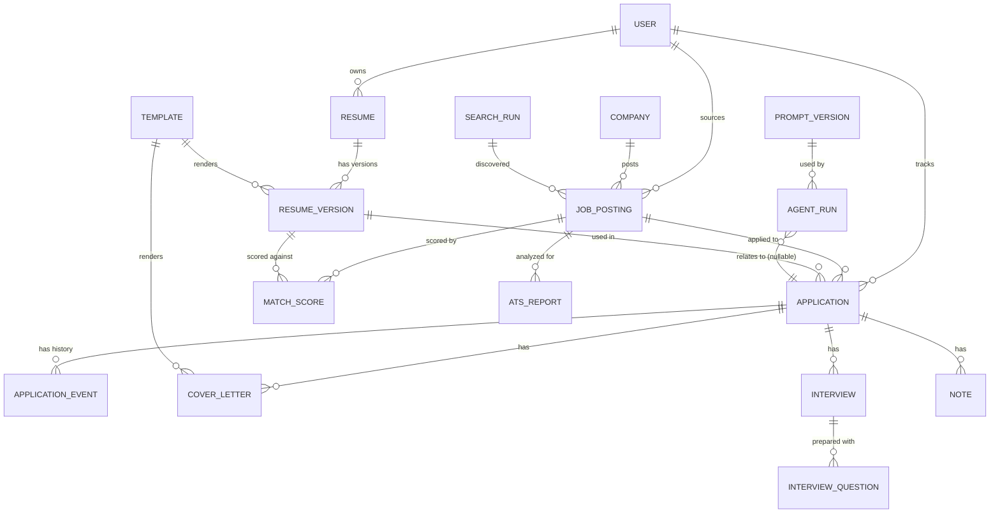

# Database Design — JOB_HUNT

Status: Draft v1.0 · Last updated: 2026-08-02

Engine: SQLite via SQLAlchemy (`decisions.md` ADR-0002), migrations via
Alembic (`rules.md` §Refactoring Rules). Binary/large content
(PDFs, LaTeX, raw HTML) is **never** stored in these tables — tables
store a relative `file_path` into `data/documents/` or `data/raw/`
(`decisions.md` ADR-0006). All tables include `id` (UUID string,
primary key), `created_at`, `updated_at` (UTC timestamps) unless noted.
A `user_id` column exists on every table but is unused/defaulted to a
single local user in v1 — reserved for the multi-user migration path
noted in `decisions.md` ADR-0002.

## Entity-Relationship Overview

## 1. `users`

Single-row in v1 (one local user), schema present for the multi-user
migration path.

| Column | Type | Notes |
|---|---|---|
| id | UUID PK | |
| display_name | text | |
| default_locale | text | default `"en"` |
| created_at / updated_at | timestamp | |

## 2. `candidate_profiles` (Resume, structured)

The output of the Resume Analysis Agent (`agents.md`). One profile can
have many `resume_versions` (tailored renders).

| Column | Type | Notes |
|---|---|---|
| id | UUID PK | |
| user_id | UUID FK → users | |
| source_file_path | text | original uploaded CV, under `data/raw/` |
| full_name, email, phone, location | text | nullable |
| summary | text | nullable |
| skills | JSON list[str] | |
| experience | JSON list[ExperienceEntry] | structured (title, company, dates, bullets) |
| education | JSON list[EducationEntry] | |
| certifications | JSON list[str] | |
| raw_extraction_confidence | float | 0–1, per-field confidence optional in JSON |
| created_at / updated_at | timestamp | |

**Constraint:** exactly one `candidate_profiles` row is "active" per
user at a time (`is_active boolean`, partial unique index where
`is_active = true`) — re-running `/setup` creates a new version rather
than mutating the active one in place (`rules.md` §Refactoring Rules
spirit: never silently overwrite history).

## 3. `resume_versions` (tailored CV renders)

| Column | Type | Notes |
|---|---|---|
| id | UUID PK | |
| profile_id | UUID FK → candidate_profiles | |
| job_posting_id | UUID FK → job_postings, nullable | null = generic/base version |
| template_id | UUID FK → templates | |
| rendered_pdf_path | text | under `data/documents/<application_id>/` |
| rendered_tex_path | text | source LaTeX, kept alongside PDF |
| ats_verification_passed | boolean | set by Phase 11 verification step |
| ats_extracted_text_path | text | plaintext extraction used for verification |
| agent_run_id | UUID FK → agent_runs | traceability to exactly what produced it |
| created_at | timestamp | |

## 4. `companies`

| Column | Type | Notes |
|---|---|---|
| id | UUID PK | |
| name | text | unique (normalized casing) |
| domain | text | nullable, for dedup/enrichment |
| notes | text | nullable, freeform |
| created_at / updated_at | timestamp | |

## 5. `job_postings`

| Column | Type | Notes |
|---|---|---|
| id | UUID PK | |
| user_id | UUID FK → users | |
| company_id | UUID FK → companies | |
| source | text | e.g. `"greenhouse"`, `"manual_import"` |
| source_id | text | source's native posting ID |
| title | text | |
| location | text | |
| remote_type | text | `"remote"` \| `"hybrid"` \| `"onsite"` \| `"unknown"` |
| url | text | |
| raw_content_path | text | untrusted raw HTML/JSON, under `data/raw/` |
| normalized_description | text | cleaned plaintext used for prompts |
| posted_at | timestamp | nullable, source-reported |
| discovered_at | timestamp | when JOB_HUNT found it |
| search_run_id | UUID FK → search_runs, nullable | |
| created_at / updated_at | timestamp | |

**Constraint:** unique on `(source, source_id)` — the primary dedup
key; a secondary fuzzy-dedup pass (`company + title + location` +
content hash) flags likely-duplicates across sources without merging
them automatically (`agents.md` §Job Search Agent).

## 6. `match_scores`

| Column | Type | Notes |
|---|---|---|
| id | UUID PK | |
| job_posting_id | UUID FK → job_postings | |
| profile_id | UUID FK → candidate_profiles | |
| score | float | 0–100 |
| matched_requirements | JSON list[str] | |
| missing_requirements | JSON list[str] | |
| red_flags | JSON list[str] | nullable |
| rationale | text | human-readable explanation, never omitted |
| agent_run_id | UUID FK → agent_runs | |
| created_at | timestamp | |

**Constraint:** unique on `(job_posting_id, profile_id, agent_run_id
prompt_version)` conceptually — practically, unique on
`(job_posting_id, profile_id)` with re-scoring creating a new row and
the prior one retained for history (never overwritten — supports
regression comparison in `testing.md`).

## 7. `ats_reports`

| Column | Type | Notes |
|---|---|---|
| id | UUID PK | |
| job_posting_id | UUID FK → job_postings | |
| profile_id | UUID FK → candidate_profiles | |
| supported_gaps | JSON list[str] | keywords missing but backed by real experience |
| unsupported_gaps | JSON list[str] | keywords missing and NOT backed — must not be added |
| formatting_warnings | JSON list[str] | e.g., non-standard section headers |
| agent_run_id | UUID FK → agent_runs | |
| created_at | timestamp | |

## 8. `cover_letters`

| Column | Type | Notes |
|---|---|---|
| id | UUID PK | |
| application_id | UUID FK → applications, nullable until application created | |
| job_posting_id | UUID FK → job_postings | |
| resume_version_id | UUID FK → resume_versions | for consistency cross-check |
| template_id | UUID FK → templates | |
| rendered_pdf_path | text | |
| rendered_tex_path | text | |
| agent_run_id | UUID FK → agent_runs | |
| created_at | timestamp | |

## 9. `applications`

| Column | Type | Notes |
|---|---|---|
| id | UUID PK | |
| user_id | UUID FK → users | |
| job_posting_id | UUID FK → job_postings | unique — one application per posting |
| resume_version_id | UUID FK → resume_versions | |
| cover_letter_id | UUID FK → cover_letters, nullable | |
| status | text | see status enum below |
| submitted_at | timestamp | nullable until submitted |
| source_channel | text | `"email"` \| `"portal"` \| `"referral"` \| ... |
| created_at / updated_at | timestamp | |

**Status enum:** `drafted → submitted → screening → interview_scheduled
→ interview_completed → offer → rejected → withdrawn`. `status` is
mutable (current state); every transition is also appended to
`application_events` (`design.md` §3 — soft state, hard history).

## 10. `application_events`

| Column | Type | Notes |
|---|---|---|
| id | UUID PK | |
| application_id | UUID FK → applications | |
| from_status | text | nullable (first event has no prior status) |
| to_status | text | |
| note | text | nullable, freeform |
| occurred_at | timestamp | |
| source | text | `"user"` \| `"gmail_sync"` \| `"system"` |

Append-only — never updated or deleted (audit trail).

## 11. `interviews`

| Column | Type | Notes |
|---|---|---|
| id | UUID PK | |
| application_id | UUID FK → applications | |
| scheduled_at | timestamp | nullable |
| interview_type | text | `"phone_screen"` \| `"technical"` \| `"onsite"` \| `"final"` |
| outcome | text | nullable until known |
| created_at / updated_at | timestamp | |

## 12. `interview_questions` (Interview Prep pack contents)

| Column | Type | Notes |
|---|---|---|
| id | UUID PK | |
| interview_id | UUID FK → interviews | |
| category | text | `"technical"` \| `"behavioral"` \| `"company"` \| `"role_specific"` |
| question | text | |
| suggested_talking_points | JSON list[str] | grounded in resume/posting — traceable |
| agent_run_id | UUID FK → agent_runs | |

## 13. `notes`

Freeform notes attachable to an application or company (user-authored,
not agent-generated).

| Column | Type | Notes |
|---|---|---|
| id | UUID PK | |
| application_id | UUID FK → applications, nullable | |
| company_id | UUID FK → companies, nullable | |
| body | text | |
| created_at / updated_at | timestamp | |

## 14. `templates`

Registry of document templates (`decisions.md` ADR-0008 — templates
are data, registered via `templates/registry.yaml`, but persisted here
so `resume_versions`/`cover_letters` can reference which one was used).

| Column | Type | Notes |
|---|---|---|
| id | UUID PK | |
| kind | text | `"resume"` \| `"cover_letter"` |
| name | text | unique per kind |
| file_path | text | `.tex.jinja` source under `documents/templates/` |
| description | text | |
| created_at / updated_at | timestamp | |

## 15. `prompt_versions` (Prompt Library index)

Mirrors the files under `prompts/library/` (`prompts.md`) so runs can
be joined back to the exact prompt text used, even after later edits.

| Column | Type | Notes |
|---|---|---|
| id | UUID PK | |
| agent_domain | text | e.g. `"resume_analysis"` |
| name | text | e.g. `"extract_profile"` |
| version | text | semver-like, e.g. `"1.2"` |
| file_path | text | `prompts/library/<domain>/<name>/<version>.md` |
| checksum | text | sha256 of file contents at index time, for drift detection |
| created_at | timestamp | |

**Constraint:** unique on `(agent_domain, name, version)`.

## 16. `agent_runs` (the audit trail — `design.md` §9)

| Column | Type | Notes |
|---|---|---|
| id | UUID PK (= `run_id` used in logs) | |
| agent | text | registry name |
| prompt_version_id | UUID FK → prompt_versions, nullable | nullable for non-LLM agents |
| model | text | |
| tokens_in / tokens_out | integer | |
| cost_estimate_usd | float | |
| latency_ms | integer | |
| status | text | `"ok"` \| `"warning"` \| `"error"` |
| warnings | JSON list[str] | |
| input_ref | text | pointer to the input record (e.g., `job_posting_id`) |
| created_at | timestamp | |

## 17. `search_runs` (Search History)

| Column | Type | Notes |
|---|---|---|
| id | UUID PK | |
| user_id | UUID FK → users | |
| query | JSON (SearchQuery) | keywords/locations/filters used |
| sources_queried | JSON list[str] | |
| postings_found | integer | |
| postings_deduped_new | integer | |
| started_at / completed_at | timestamp | |

## 18. Analytics (derived, not a stored table in v1)

`AnalyticsReport` (Career Analytics Agent output) is **computed on
read** from `applications` + `application_events` + `job_postings`, not
persisted as its own mutable table — avoids a second source of truth
that could drift from the underlying event history. If pre-aggregation
becomes a performance need later (unlikely at single-user scale), a
materialized `analytics_snapshots` table can be added as a pure cache,
invalidated on any `application_events` insert — record that as a new
ADR if/when it happens (`decisions.md`).

## Indexing Notes

- `job_postings(source, source_id)` — unique index (dedup).
- `applications(job_posting_id)` — unique index (one application per
  posting).
- `match_scores(job_posting_id, profile_id)` and
  `agent_runs(agent, created_at)` — non-unique indexes for common query
  patterns (ranking, audit lookups).
- All FK columns indexed by default (SQLAlchemy relationship access
  pattern).

## Migration Policy

Every schema change ships an Alembic revision in the same PR as the
model change (`rules.md` §Refactoring Rules). No production ALTER
statements outside Alembic, even in solo-dev mode — this habit is what
makes the eventual open-source contributor experience
(`README.md` setup) reliable.
